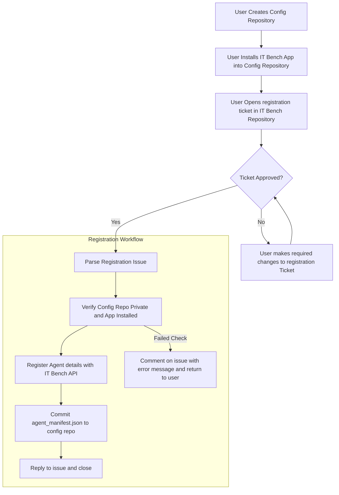

# GitHub Actions Documentation for IT Bench

## General

To support the IT Bench user experience, this repository contains a number of GitHub Actions workflows that automate required tasks.

These include:
 - [Agent Registration](#agent-registration)
 - [Public Leaderboard Updates](#public-leaderboard-updates)

## Agent Registration

## Public Leaderboard updates

## Setup

### Creating the GitHub Application and configuring for GH Actions

1. Go to your [GitHub Apps page](https://github.com/settings/apps) in your developer settings and click "New GitHub App"
2. Populate the following Settings:
    - GitHub App name
    - Homepage URL (Set to the IT Bench Repo)
    - Disable Webhook
    - Permissions:
        - Repository Permissions:
            - Metadata: Read-Only (Default)
            - Single file: Read and Write
                - Path: agent-manifest.json
        - Organisation Permissions: None
        - Account Permissions: None
    - Where can this GitHub App be installed? - Any Account
3. Within the App settings, generate a private key and backup in 1password.
4. In the GitHub Repo Settings:
    - Environments - Create a new environment called `onboarding`
        - Environment Secrets:
            - `ITBENCH_APP_KEY` - Set to the generated Private Key\
            - `ITBENCH_API_TOKEN` - Set to the JWT token for the IT Bench API
        - Environment Variables:
            - `ITBENCH_APP_ID` - Set to the App ID number
            - `ITBENCH_API` - The IT Bench Server API Endpoint
    - Actions:
        - Allow all actions and reusable workflows
        - Require approval for all external contributors
        - Read and write permissions
    - Runners (If using an external runner)
        - Create the runner using default options.